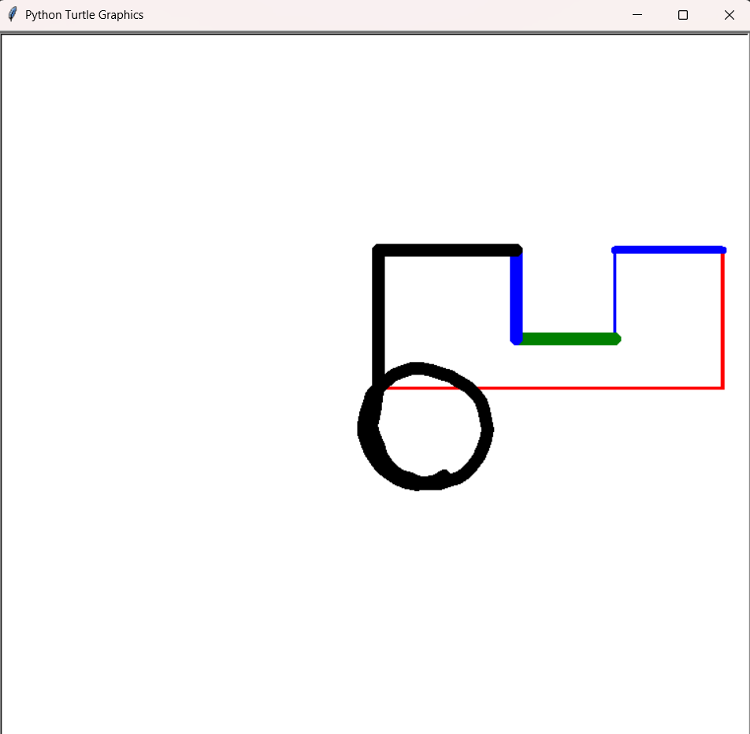

# Etch-A-Turtle

- A digital recreation of the classic Etch-A-Sketch toy using Python's turtle graphics library. 
- Draw, customize, and create art with simple keyboard controls!

## Features

- **Movement Controls**: Use WASD keys to move and draw
- **Color Options**: Switch between red, green, blue, and black
- **Pen Thickness**: Adjust line thickness on the fly
- **Speed Control**: Change drawing speed
- **Clear Screen**: Reset your canvas instantly

## Controls

### Movement
- `W` - Move forward
- `S` - Move backward  
- `A` - Turn left (10 degrees)
- `D` - Turn right (10 degrees)

### Colors
- `R` - Red pen
- `G` - Green pen
- `B` - Blue pen
- `K` - Black pen

### Pen Settings
- `+` - Increase pen thickness
- `-` - Decrease pen thickness

### Speed Control
- `U` - Increase drawing speed
- `P` - Decrease drawing speed

### Utility
- `C` - Clear screen and return to center

## Requirements

- Python 3.x
- turtle module

## How to Run

```bash
python main.py
```

## Getting Started

1. Run the program
2. Use WASD keys to move the turtle around the screen
3. The pen will automatically draw as you move
4. Experiment with different colors and pen thickness
5. Press 'C' to clear and start over

## Tips

- Start with slow speed to get familiar with the controls
- Try different pen thicknesses for varied line effects
- Use the turn controls (A/D) to create curves and angles
- Combine colors to create colorful artwork

## Small Example:


Enjoy creating digital art with your Python Etch-A-Turtle!